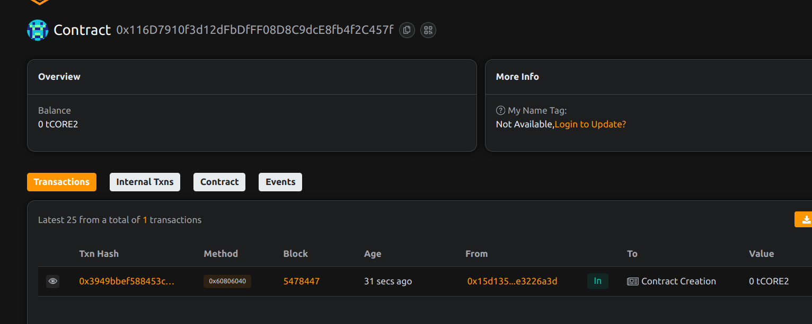

# DecentraJobs – Blockchain-Based Gig and Task Marketplace

## 📄 Project Description

DecentraJobs is a decentralized application that allows users to post tasks or gigs and have freelancers accept, complete, and get paid for them in a secure, trustless environment.

## 🎯 Project Vision

To empower the freelance economy by building a trustless, censorship-resistant gig marketplace directly on-chain, enabling fair labor opportunities for all.

## ✨ Key Features

- 📝 Post gigs with attached rewards
- 🙋 Freelancers can accept open jobs
- ✅ Clients confirm completion to trigger payout
- 🚫 Jobs can be cancelled by the client before acceptance
- 💰 Fully on-chain escrow and payment logic

## 🔮 Future Scope

- Reputation system for clients and freelancers
- Token-based incentive or staking
- Arbitration system for dispute resolution
- Cross-chain task execution using oracles

## 📜 Contract Details
0x116D7910f3d12dFbDfFF08D8C9dcE8fb4f2C457f
